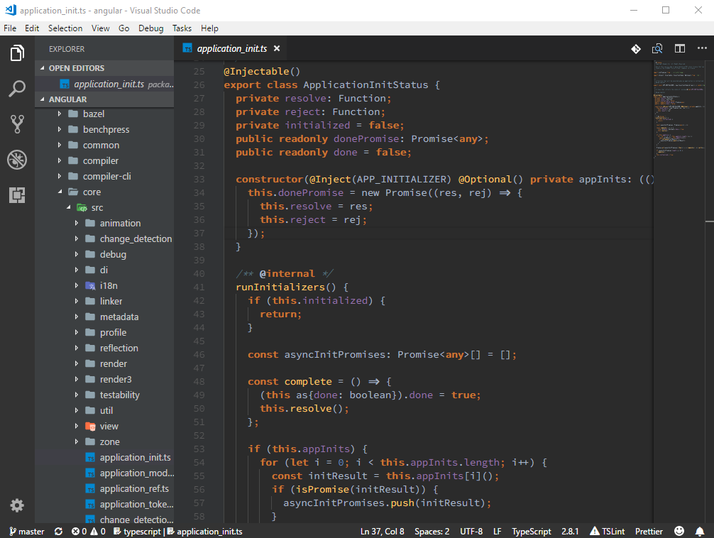

# Dracula Theme - WebStorm Edition

This is a Dracula Dark Theme mirroring colors in the Dracula theme in WebStorm by JetBrains.

This theme start from [dracula/textmate](https://github.com/dracula/textmate/blob/master/Dracula.tmTheme) and then fine-tuned to WebStorm's Dracula Theme.

## Angular Component Template

This theme now can work with [vscode-angular-html](https://marketplace.visualstudio.com/items?itemName=ghaschel.vscode-angular-html) to support Angular template.

## Links

[Github Repository](https://www.github.com/rexebin/dracula)

My extensions:

[ClassLens:](https://marketplace.visualstudio.com/items?itemName=rexebin.classlens) ClassLens shows class's relationships with its interfaces and parent class in the form of CodeLens

[ClassIO:](https://marketplace.visualstudio.com/items?itemName=rexebin.classio) Class IO shows class relationships with its interfaces and parent class in a non-obstructive way. Class IO is an alternative to ClassLens.

[F12: Open File:](https://marketplace.visualstudio.com/items?itemName=rexebin.f12-open-file) Extending Go to definition to open file when the look up symbol is a file name with relative path.

[Angular Lite:](https://marketplace.visualstudio.com/items?itemName=rexebin.angular-lite) An extension pack for Angular developers.

[Angular Extension Pack:](https://marketplace.visualstudio.com/items?itemName=rexebin.angular-extension-pack) An extension pack for Angular developers.
