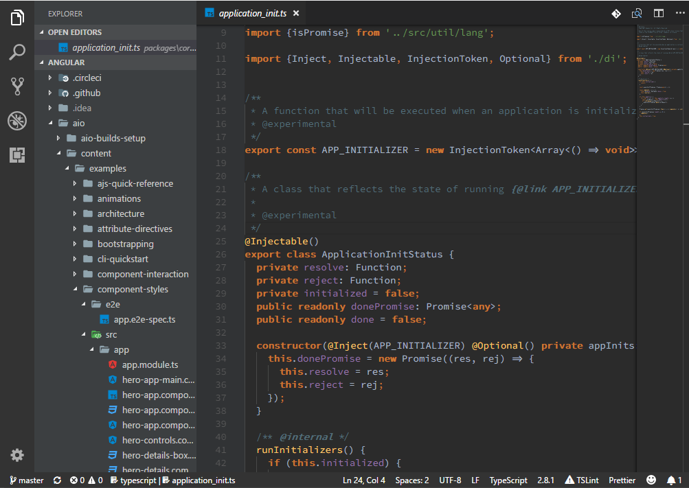

# Darcula Theme - WebStorm Edition

This is a Darcula Dark Theme mirroring colors in the Darcula theme in WebStorm by JetBrains.

This theme start from [Darcula/textmate](https://github.com/Darcula/textmate/blob/master/Darcula.tmTheme) and then fine-tuned to WebStorm's Darcula Theme.

## Angular Component Template

This theme now can work with [vscode-angular-html](https://marketplace.visualstudio.com/items?itemName=ghaschel.vscode-angular-html) to support Angular template.

## Links

[Github Repository](https://www.github.com/rexebin/Darcula)

My extensions:

[ClassLens:](https://marketplace.visualstudio.com/items?itemName=rexebin.classlens) ClassLens shows class's relationships with its interfaces and parent class in the form of CodeLens

[ClassIO:](https://marketplace.visualstudio.com/items?itemName=rexebin.classio) Class IO shows class relationships with its interfaces and parent class in a non-obstructive way. Class IO is an alternative to ClassLens.

[F12: Open File:](https://marketplace.visualstudio.com/items?itemName=rexebin.f12-open-file) Extending Go to definition to open file when the look up symbol is a file name with relative path.

